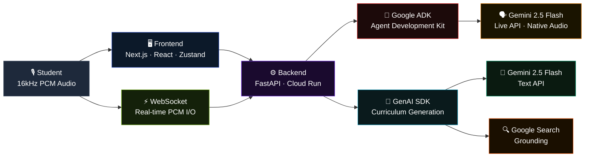
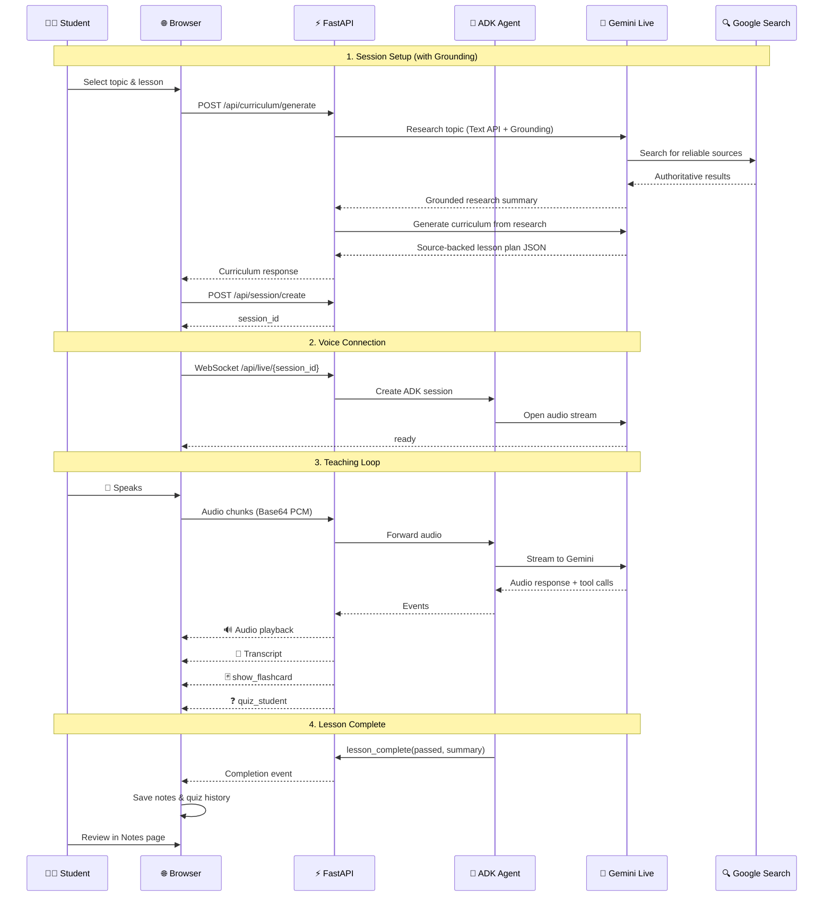
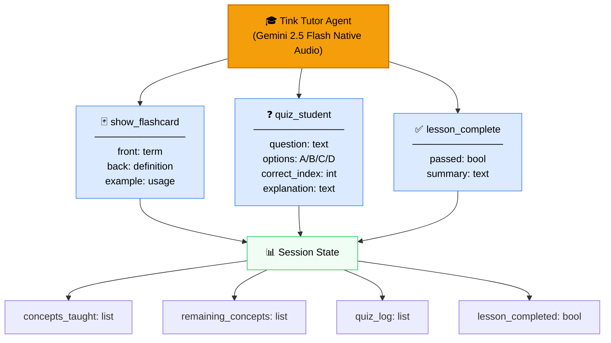
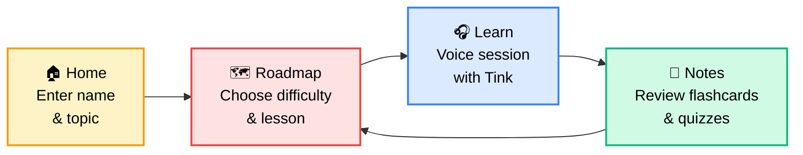

# Architecture Diagram

## Main System Architecture

Use this at [mermaid.live](https://mermaid.live) to generate the visual diagram for submission.

## Detailed Voice Session Flow

## Agent Tool Architecture

## User Journey

